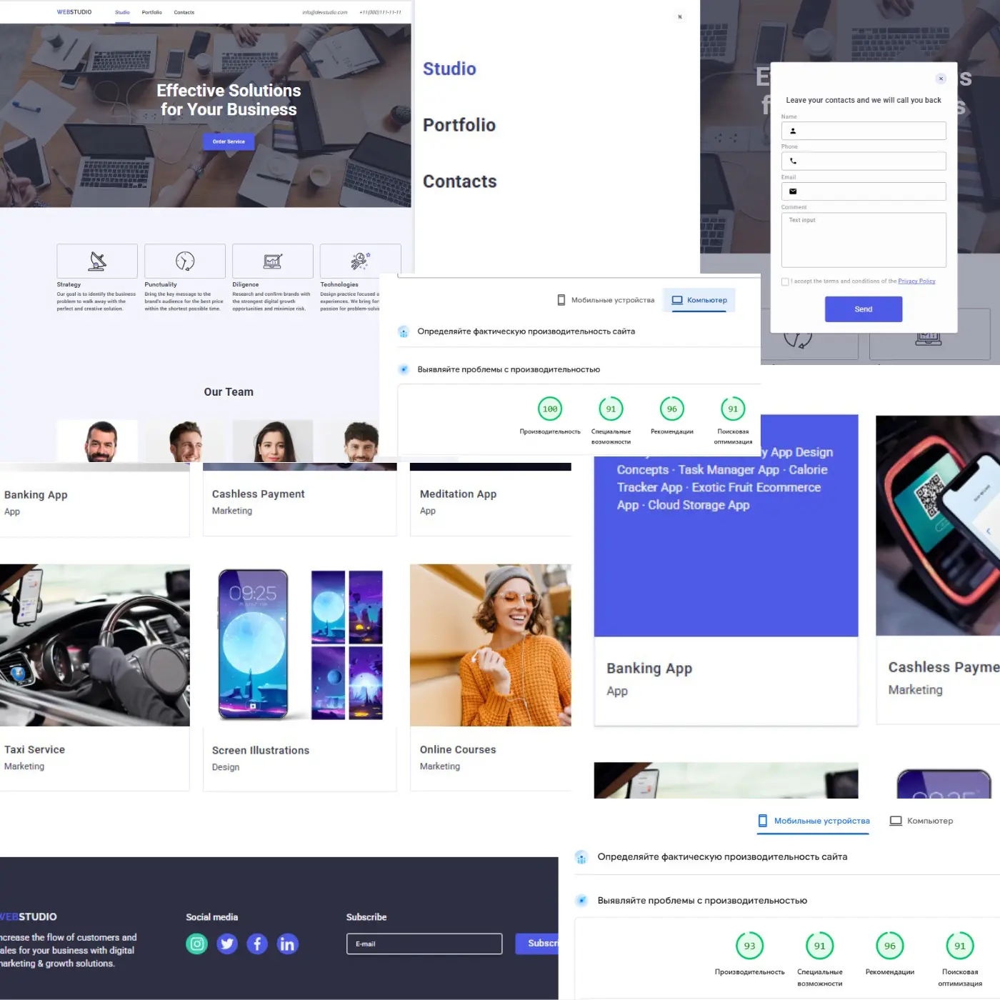

🌐 WebStudio (Vite Edition)

👉 Live Demo: 🔗 https://bashmachok1982.github.io/WebStudio-Vite-Alexander/

👉 Repository: 🔗 https://github.com/bashmachok1982/WebStudio-Vite-Alexander

📌 О проекте

WebStudio — это учебный проект, который со временем был полностью переработан и
прокачан.

Изначально сайт создавался как обычный HTML/CSS/JS-проект в учебных целях. Позже
он был рефакторен, перенесён на Vite и приведён к более профессиональному виду —
с упором на архитектуру, поддержку и производительность.

🔄 Эволюция проекта 🧱 Было

Классический учебный сайт

Статическая структура

Цвета и стили разбросаны по CSS

Минимальная модульность

🚀 Стало

⚡ Vite как сборщик проекта

🎨 CSS Variables для всех цветов и шрифтов

🧩 Чёткая структура файлов и папок

📱 Адаптивная вёрстка (mobile + desktop)

🛠 Удобная масштабируемость проекта

🎨 Стили и дизайн

Все цвета вынесены в :root

background

text

accent

border

hover / focus

Используется семантическое именование переменных

Шрифты также вынесены в переменные

Изображения аккуратно разложены по папкам

Код стал проще поддерживать и расширять

📈 Производительность

Несмотря на:

полный рефакторинг стилей

переход на CSS-переменные

переработку структуры

оптимизацию ассетов

👉 производительность не пострадала 💪

🔍 Lighthouse результаты:

📱 Mobile: 91+

🖥 Desktop: 96%

🛠 Используемые технологии

🧱 HTML5

🎨 CSS3 (CSS Variables)

⚙️ JavaScript (ES Modules)

⚡ Vite

🌍 GitHub Pages

🖼 Превью

  

